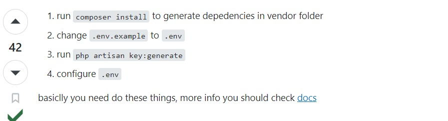

## After Cloning

Langkah-langkah setelah cloning, jalankan di project lokal:

Kemudian jalankan "composer require doctrine/dbal"

Login gunakan email yang terdaftar di database dan password yang belum di hash
Untuk UserX@gmail.com passwordnya UserX (User1@gmail.com memiliki password User1)
